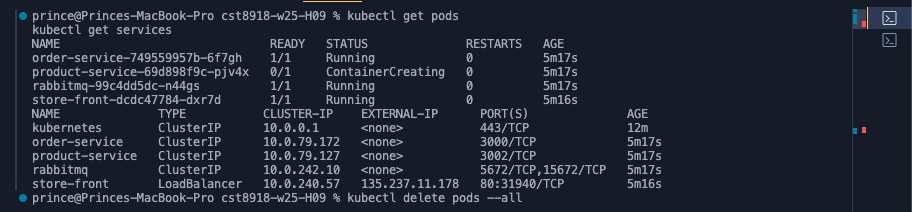

# Hybrid-H09 Azure Kubernetes Service (AKS) Cluster with Terraform

This project involved creating an Azure Kubernetes Service (AKS) cluster using Terraform to deploy a sample application. 

## Tasks Completed:
    - Provisioned an AKS cluster with Terraform.
    - Deployed the sample application to the AKS cluster using Kubernetes.
    - Successfully connected to the AKS cluster with kubectl.
    - Verified the deployment by accessing the app via the store-front service's external IP.

